<div align="center">


</div>

# 👋 Hey, I'm Kishan

### `AI/ML Engineer in the making`

I build machine learning systems and turn AI ideas into practical applications.

I'm particularly interested in **Artificial Intelligence, Machine Learning, Computer Vision, Generative AI, LLM applications, and backend systems for AI.**

---

## 🧠 What I Work With

### AI / Machine Learning

- Python
- NumPy
- OpenCV
- PyTorch
- Scikit-learn
- Computer Vision
- Deep Learning
- Generative AI
- LLMs
- RAG systems

### AI Engineering

- FastAPI
- Streamlit
- PostgreSQL
- Docker
- Git
- GitHub
- CUDA
- REST APIs

### Full-Stack & Infrastructure

- React
- Node.js
- MongoDB
- Redis
- Django
- Flask
- React Native
- Apache Kafka

---

## 🚀 What I'm Building

I'm focused on building projects that combine **machine learning with real-world software engineering**.

Some areas I'm exploring:

- 🤖 AI-powered applications
- 🧠 RAG and LLM systems
- 👁️ Computer vision
- ⚡ FastAPI-based ML APIs
- 📊 ML dashboards and applications
- 🐳 Containerized AI systems
- 🗄️ AI applications with databases
- 🔄 Real-time AI pipelines

---

## 📈 GitHub Activity

<div align="center">



</div>

---

## 🛠️ Tech Stack

<p align="center">


</p>

---

## 🎯 Currently Learning

```text
Machine Learning
       ↓
Deep Learning
       ↓
Computer Vision
       ↓
Generative AI
       ↓
LLMs + RAG
       ↓
AI Engineering
       ↓
Production AI Systems